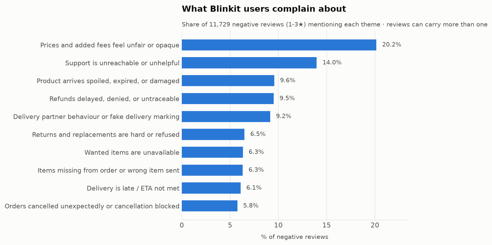
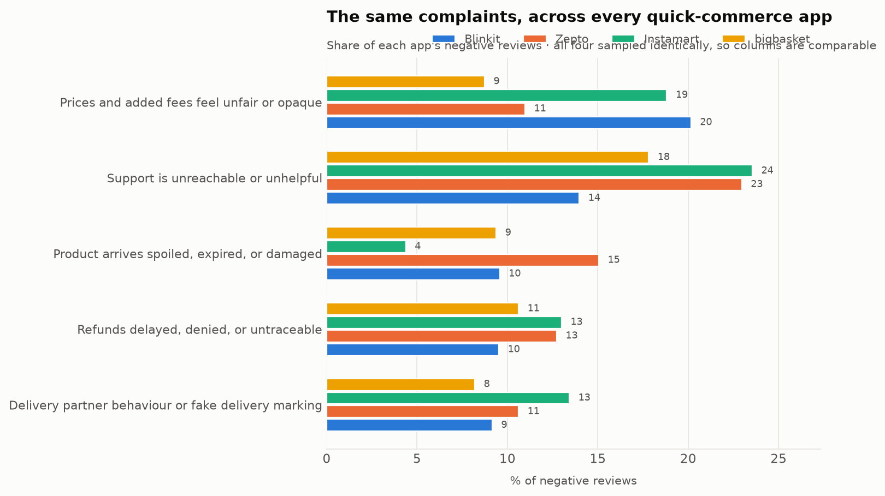

# Data-Driven 0→1 Product Strategy — Indian Quick Commerce

**A complete product management case study built on 40,671 real user reviews.**

No surveys. No invented personas. Every problem, persona, and priority in this repository traces back to
something a real user actually wrote.

**▶ [Read the case study](index.html)** · **[Try the prototype](prototype/index.html)**
 · **[Full summary](SUMMARY.md)**

*(Once GitHub Pages is enabled, the case study lives at
`https://clammyface.github.io/cost-of-10-minutes/` — see [Publishing the site](#publishing-the-site).)*

---

## The finding

> **Blinkit's most frequent user complaint is not slow delivery — it is the cost of delivery.**

Mining **19,424 Blinkit reviews (11,729 negative)** against a 14-theme complaint taxonomy:

| Rank | Complaint | Share of negative reviews |
| --- | --- | --- |
| **1** | **Prices and added fees feel unfair or opaque** | **20.2%** |
| 2 | Support unreachable or unhelpful | 14.0% |
| 3 | Product spoiled, expired, or damaged | 9.6% |
| 4 | Refunds delayed, denied, untraceable | 9.5% |
| … | | |
| **9** | **Delivery late / ETA missed** | **6.1%** |

Blinkit has essentially solved the problem it was founded to solve. **Speed is no longer the complaint —
the price of that speed is.**

<picture>
  <source media="(prefers-color-scheme: dark)" srcset="charts/01-complaint-themes-dark.png">
  
</picture>

### Three things that make this a real product problem

1. **The complaint is about sequence, not amount.** Users itemise the fees accurately — *"product charges
   only 98 But Delivery Charges 30 Handling Charges 5 Small cart Fee 20"*. The information existed. It
   arrived **after** the cart was built.
2. **The complainers are otherwise happy.** Fee complaints run **25.8% among 3★ reviewers vs 14.1% among
   1★**, and fee complainers mention every other problem at roughly **half** the base rate. These are
   habituated, profitable users with exactly one objection.
3. **A competitor has already moved.** **Zepto scrapped all handling and surge fees** — and carries
   **11.0%** fee complaints against Blinkit's 20.2%, same cities, identical sampling.

Blinkit cannot match it. At **0.6% adjusted EBITDA margin** with a **falling AOV (₹521 → ₹518)**, blanket
fee removal inverts profitability built over five quarters. So the problem becomes:

> **Make fees feel fair, predictable, and controllable — without removing them.**

The answer, chosen by RICE across 15 candidates: **Smart Cart** — live landed-cost preview, free-delivery
progress, and reorder-ranked basket completion. It resolves the grievance *and* raises AOV, because helping
a user clear a fee threshold means a bigger basket.

**▶ [Try the interactive prototype](prototype/index.html)**

---

## The 15 documents

| # | Document | What's in it |
| --- | --- | --- |
| 1 | [Product & Market](docs/01_product_market.md) | Business model, unit economics, competitor matrix |
| 2 | [User Research](docs/02_user_research.md) | 40,671 reviews, taxonomy, **validation & limitations** |
| 3 | [Personas](docs/03_personas.md) | 4 personas, each sized from the corpus |
| 4 | [Jobs-to-be-Done](docs/04_jtbd.md) | 10 JTBD statements with source reviews |
| 5 | [Problem Definition](docs/05_problem_definition.md) | Severity-weighted ranking, problem statement, HMW |
| 6 | [Strategy & OKRs](docs/06_strategy_okrs.md) | Vision, strategic objective, 3 OKRs |
| 7 | [Metrics](docs/07_metrics.md) | North Star, KPI tree, guardrails, counter-metrics |
| 8 | [Competitive & Opportunity](docs/08_competitive_opportunity.md) | Gap analysis, opportunity map, positioning |
| 9 | [Solution Ideation](docs/09_solution_ideation.md) | 15 solutions across 4 mechanisms |
| 10 | [Prioritization](docs/10_prioritization.md) | RICE, P0/P1/P2, dependencies, risks |
| 11 | [PRD](docs/11_prd.md) | Smart Cart — requirements, edge cases, acceptance criteria |
| 12 | [UX & Prototype](docs/12_ux_prototype.md) | Journeys, screen spec, **clickable prototype** |
| 13 | [Experimentation](docs/13_experimentation.md) | Hypothesis, A/B design, sample sizing, decision criteria |
| 14 | [Analytics & Launch](docs/14_analytics_launch.md) | Event spec, funnels, cohorts, GTM, phased rollout |
| 15 | [Post-Launch & Iteration](docs/15_post_launch.md) | Results vs criteria, failures, next hypothesis |

---

## The data

| | |
| --- | --- |
| **Reviews analysed** | **40,671** (58,200 raw, deduped and filtered) |
| **Apps** | Blinkit 19,424 · Zepto 7,244 · bigbasket 7,270 · Swiggy Instamart 6,733 |
| **Date range** | 2018-09-12 → 2026-08-24 |
| **Median length** | 30 words |
| **Retrieved** | 2026-08-25 |

Business context from Eternal and Swiggy quarterly results, plus published market-share estimates.

<picture>
  <source media="(prefers-color-scheme: dark)" srcset="charts/03-theme-by-app-dark.png">
  
</picture>

---

## Honest limitations

Stated up front, because a case study that hides its weaknesses is not worth reading.

**The corpus is deliberately skewed.** Reviews were pulled with an equal quota per star rating, so 1–3★
are massively over-represented **on purpose** — the taxonomy needs negative text to cluster on. Blinkit's
real average is **4.58★ across ~9.0M ratings**. Every figure here is a share of *negative reviews*, never
of users. See [`sampling_note.md`](data/processed/sampling_note.md).

**Recall is imperfect, so every share is a lower bound.** Hand-labelling 40 reviews found **68% of negative
reviews received at least one correct theme**, with 32% carrying a real complaint that no rule caught.
Precision is good — false positives were rare. Because recall errors spread across themes rather than
concentrating in one, the *ranking* is more robust than the levels. Full audit in
[docs/02 §2.4](docs/02_user_research.md).

**Android only.** Apple's public review RSS now returns zero entries for every app tested; reviews moved
behind the authenticated App Store Connect API. Reddit's JSON endpoints return HTTP 403 without OAuth.
Both were attempted, both failed, both are documented rather than quietly dropped.

**The post-launch results in [doc 15](docs/15_post_launch.md) are modelled, not measured.** Smart Cart was
never shipped — this is a portfolio case study. Those projections are labelled throughout. Everything
upstream of doc 15 is real and verifiable.

---

## Publishing the site

The case study is a self-contained `index.html` at the repo root — no build step, no framework.

1. Push this repo to GitHub
2. **Settings → Pages → Source:** `Deploy from a branch`
3. **Branch:** `main`, folder `/ (root)` → **Save**
4. Wait ~60 seconds

Your site is then live at `https://clammyface.github.io/cost-of-10-minutes/`, and the prototype at
`https://clammyface.github.io/cost-of-10-minutes/prototype/`. Both are yours, on your domain, free.

To use your own domain instead, add a `CNAME` file containing it and point a DNS `CNAME` record at
`clammyface.github.io`.

---

## Reproduce it

```bash
pip install -r requirements.txt

python src/scrape_reviews.py   # ~10 min → data/raw/
python src/clean.py            # 58,200 → 40,671
python src/analyze.py          # taxonomy, frequency, trend, validation sample
python src/charts.py           # 10 charts, light + dark
```

### Repository layout

```
docs/01..15_*.md          the 15 case study documents
prototype/index.html      clickable Smart Cart prototype
src/
  scrape_reviews.py       star-stratified Play Store scraper
  clean.py                dedupe, filter, normalise
  analyze.py              14-theme taxonomy, TF-IDF validation, severity model
  charts.py               validated palette, light + dark output
data/processed/           tidy CSVs — committed, so numbers are checkable
charts/                   rendered figures
```

`data/raw/` is gitignored (~48 MB of JSON, regenerable). `data/processed/` **is** committed — a reader
should be able to verify any number without re-running a 10-minute scrape.

### Notes on the code

- **No scikit-learn.** TF-IDF is implemented directly in ~30 lines, because scipy's compiled extensions
  are blocked by Application Control policy on some managed Windows machines. Three dependencies total.
- **Keyword taxonomy, not clustering.** k-means over TF-IDF produced clusters organised around generic
  sentiment words (*good, worst, app*) that map onto no product decision. Rules are auditable and each
  corresponds to something a team can own. TF-IDF is used instead to find *taxonomy holes* — ranking terms
  in reviews no rule caught, which is how the untagged rate went 40.9% → 32.9%.
- **Charts render light and dark**, on a palette validated for colour-vision deficiency in both modes.

---

## Method

```
RESEARCH    40,671 reviews · 14-theme taxonomy · validated              [02]
    ↓
PROBLEM     Fees 20.2% of negative reviews · severity-weighted to #1    [05]
    ↓
STRATEGY    Fix perception, not price — 0.6% margin forbids fee cuts    [06]
    ↓
PRIORITISE  15 solutions · RICE · fee removal scored #1 and rejected    [10]
    ↓
BUILD       Smart Cart PRD + prototype                                  [11][12]
    ↓
MEASURE     Pre-registered A/B · 6 guardrails · 5→25→50→100%            [13][14]
    ↓
LEARN       Transparency without agency harms · roadmap changed         [15]
    ↓
ITERATE ────┘
```

---

*Built as a product management portfolio project. All data is public. Blinkit, Zepto, Swiggy Instamart,
and bigbasket are trademarks of their respective owners; this analysis is independent and unaffiliated.*
