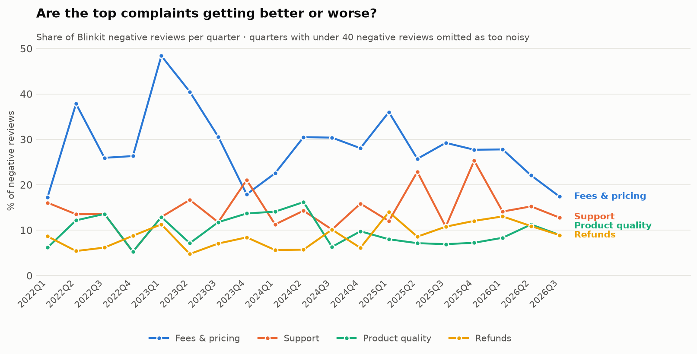

# 2. User Research Using Existing Data

No surveys, no interviews. This study reads **40,671 real Google Play reviews** that users wrote
unprompted, across four Indian quick-commerce apps, spanning September 2018 to August 2026.

---

## 2.1 The corpus

| | Blinkit | Zepto | Instamart | bigbasket | **Total** |
| --- | --- | --- | --- | --- | --- |
| Clean reviews | **19,424** | 7,244 | 6,733 | 7,270 | **40,671** |
| Negative (1–3★) | **11,729** | — | — | — | 25,569 |

- **Date range:** 2018-09-12 → 2026-08-24
- **Median review length:** 30 words (substantive text, not one-word ratings)
- **Retrieved:** 2026-08-25

### How it was collected

`src/scrape_reviews.py` pulls from the Play Store with an **equal quota per star rating (1–5)** across
**two sort orders** — `NEWEST` for a dense recent window, `MOST_RELEVANT` for Play's own high-signal
ranking, which reaches further back and surfaces longer reviews.

`src/clean.py` then reduces 58,200 raw rows to 40,671:

| Step | Rows |
| --- | --- |
| Raw pulled | 58,200 |
| After dedupe (same review reachable from both sort orders) | 53,768 |
| After dropping reviews under 15 characters | 40,776 |
| After dropping majority non-Latin-script text | **40,671** |

Romanised Hindi/Hinglish is **kept** — it is a large share of the Indian corpus and the keyword taxonomy
reads it fine. Devanagari-majority reviews are dropped.

## 2.2 The sampling caveat — read this before quoting any number

**This corpus is not a random sample and its rating mix is not Blinkit's real rating mix.**

Blinkit's true Play Store distribution is **4.58★ across ~9.0M ratings**, with 76.8% of them 5★. The
corpus was deliberately built with an equal quota per star so there would be enough negative text to
cluster on. 1–3★ reviews are therefore massively over-represented **on purpose**.

That makes this data valid for:

- **relative** complaint frequency — which problems dominate *within* dissatisfaction
- complaint themes, phrasing, and severity
- cross-app comparison, since all four apps were sampled identically

It is **not** valid for overall satisfaction rates, or any claim shaped like *"X% of Blinkit users
experience Y."* Every figure below is a share of **negative reviews**, never of users.

### Other known limits

- **Android only.** Apple's public review RSS now returns zero entries for every app and region tested
  (2026-08-25); reviews moved behind the authenticated App Store Connect API. This skews the corpus away
  from iOS users, who in India skew higher-income.
- **No Reddit.** Reddit's `.json` endpoints return HTTP 403 to unauthenticated clients and require OAuth.
- **Reviewers are not users.** People who write reviews skew toward the strongly annoyed and the strongly
  delighted. Everything here describes *expressed* dissatisfaction.

## 2.3 Method: a keyword taxonomy, not unsupervised clustering

Themes are assigned by **14 curated regex rules** (`THEMES` in [../src/analyze.py](../src/analyze.py)),
not by k-means over TF-IDF.

That was a deliberate choice. Clustering short review text produced groups organised around generic
sentiment words — *good, worst, app* — that map onto no product decision. Rules are auditable,
reproducible, and each one corresponds to something a team can actually own.

TF-IDF is still used, but for **validation**: it ranks the distinguishing terms inside each theme, and —
more usefully — ranks terms concentrated in reviews that **no rule caught**, which is how taxonomy holes
get found.

**A review can carry multiple themes.** "Ordered 6 kulfis, all melted, refund took ages" is legitimately
product-quality *and* refunds *and* returns. Shares therefore sum to more than 100%.

### The taxonomy was revised twice, using the untagged terms

| Pass | Untagged share of negative reviews |
| --- | --- |
| Initial 12 rules | 40.9% |
| After adding `payment_issues`, `returns_replacement`, broadening fees/quality | 33.6% |
| After patching support, payment, packaging, offer-comparison phrasing | **32.9%** |

The untagged-term ranking showed the single largest miss was the bare word **"charges"** — the original
pricing rule only matched compound phrases like *handling fee*. In a negative review of a delivery app,
"charges" is essentially always a pricing complaint, and missing it understated the top theme materially.

## 2.4 Validation — hand-labelling, and what it says

`data/processed/validation_sample.csv` holds 100 randomly sampled Blinkit reviews. **40 were hand-labelled**
and compared against the rule output. Restricted to the 22 negative reviews in that set:

| Result | Count | Share |
| --- | --- | --- |
| Fully correct (all applicable themes, no false ones) | 9 | 41% |
| **At least one correct theme** | **15** | **68%** |
| Real complaint, but no theme assigned | 7 | 32% |
| Correctly left untagged (generic venting) | 2 | 9% |

**Precision is good; recall is the weakness.** When a theme is assigned it is almost always right — only
three false positives across roughly twenty assigned tags. What the rules miss is complaints phrased
without their keywords.

Representative misses:

| Review (abridged) | Should have been | Why it slipped |
| --- | --- | --- |
| *"23 mins delivery usually turns out to be 45 mins"* | `delivery_delay` | States the delay arithmetically — no "late" or "delay" |
| *"Pluxee card cannot be added before payment"* | `payment_issues` | Card-provisioning phrasing not in the rule |
| *"cash on delivery is not applicable"* | `payment_issues` | Rule expected "COD not available" |
| *"showing sorry, we're not [serving your area]"* | — | **Serviceability is not a theme at all** |
| *"keep neat & clean item in stock, do not supply dirty item"* | `item_quality` | "Dirty" absent from the quality rule |

### What this means for every number in this case study

1. **All theme shares are lower bounds.** True incidence is higher than reported. When this study says
   fees drive 20.2% of negative reviews, the honest reading is *"at least 20.2%."*
2. **Relative ranking is more robust than absolute levels.** Recall failures are spread across themes
   rather than concentrated in one, so the *ordering* of problems survives even though the levels are
   understated. Prioritisation in [05](05_problem_definition.md) rests on ranking, which is the sturdier
   signal.
3. **Serviceability is a genuine gap** — a 15th theme worth adding in a follow-up pass.

The 32.9% untagged rate is also less alarming than it looks: untagged negative reviews run a **median of
12 words versus 36 for tagged ones**. Most of the remainder is short generic venting — *"very bad
experience"*, *"worst app"* — which carries no actionable theme by construction.

## 2.5 What users actually complain about


Share of the **11,729 negative Blinkit reviews** mentioning each theme:

| Rank | Theme | Share | What it sounds like |
| --- | --- | --- | --- |
| 1 | **Prices and added fees feel unfair or opaque** | **20.2%** | *"₹98 product. ₹30 delivery, ₹5 handling, ₹20 small cart fee"* |
| 2 | Support is unreachable or unhelpful | 14.0% | *"no human support and no way to resolve any issue"* |
| 3 | Product arrives spoiled, expired, or damaged | 9.6% | *"6 kulfis, all delivered melted"* |
| 4 | Refunds delayed, denied, or untraceable | 9.5% | *"money deducted, no refund for 12 days"* |
| 5 | Delivery partner behaviour / fake delivery marking | 9.2% | *"marked delivered without calling"* |
| 6 | Returns and replacements refused | 6.5% | *"no platform to return or get cash back"* |
| 7 | Wanted items unavailable | 6.3% | |
| 8 | Items missing or wrong item sent | 6.3% | |
| 9 | Delivery late / ETA not met | 6.1% | |
| 10 | Orders cancelled unexpectedly | 5.8% | |
| 11 | App crashes or errors | 3.1% | |
| 12 | Packaging quality | 3.1% | |
| 13 | Payment fails / money debited without order | 2.8% | |
| 14 | Membership friction | 0.2% | |

**Fees lead by a wide margin** — 44% more prevalent than the next theme.

Note what is *not* at the top: **delivery lateness sits 9th at 6.1%.** Blinkit has essentially solved the
problem it was founded to solve. Speed is no longer the complaint; **the price of that speed is.**

## 2.6 The complaint is getting better, but from a bad place



Fee complaints peaked at **48.4% of negative reviews in 2023Q1** and have fallen to **17.4% in 2026Q3** —
a real improvement. But two caveats keep this from being a victory:

- Fees are still the **#1 theme overall**, and 2026 Q2–Q3 alone contribute 9,599 negative reviews — the
  overwhelming bulk of the corpus. Recent volume is enormous even at a lower rate.
- The decline coincides with Blinkit's user base broadening. A lower *share* of a much larger negative
  volume is not the same as fewer angry users.

A worked example of the second point. Fee complaints as a share fell from 27.8% (2026Q1) to 22.1% (Q2) to
17.4% (Q3) — but the negative-review base exploded from 468 to 3,137 to 6,462 over the same three
quarters. In absolute terms that is roughly **130 → 692 → 1,125** fee complaints per quarter. **The share
is falling while the raw count is rising nearly ninefold.** Reporting only the percentage would tell the
opposite story to the one the data supports.

Support complaints show no clean trend — they oscillate between 10% and 25% quarter to quarter (25.3% in
2025Q4, 12.8% in 2026Q3). Quarters before 2026 rest on 50–130 negative reviews each, which is too thin to
call direction from; the apparent swings are mostly sample noise.

## 2.7 It is not just a Blinkit problem — but Blinkit is exposed


All four apps were sampled identically, so these columns are directly comparable — and the fee column is
the most decision-relevant number in this entire study:

| App | Fee complaints as share of negative reviews | Fee policy |
| --- | --- | --- |
| **Blinkit** | **20.2%** | Delivery ≤₹30 · handling ₹4–11 · small cart ~₹20 · surge/rain |
| Swiggy Instamart | 18.8% | Delivery + handling + surge |
| **Zepto** | **11.0%** | **All handling and surge fees scrapped; free delivery >₹99** |
| bigbasket | 8.7% | Membership-led, not per-order fees |

**Zepto's fee complaint rate is roughly half of Blinkit's.** The two companies serve the same cities, the
same category, and a heavily overlapping user base; the sampling method was identical. The most plausible
explanation for a 9-point gap is the policy difference itself.

This is the strongest evidence in the corpus that fee *structure* — not just fee *level* — is a
controllable product variable. Zepto has demonstrated that the complaint can be halved. It is also a
warning: Blinkit's most exposed flank is the one where a well-funded competitor has already moved.

The caveat from §2.4 still applies — these are lower bounds, and the comparison is only valid because the
same rules and the same sampling were applied to all four apps.

---

## Reproduce this

```bash
pip install -r requirements.txt
python src/scrape_reviews.py   # ~10 min, writes data/raw/
python src/clean.py            # 58,200 -> 40,671
python src/analyze.py          # taxonomy, frequency, trend, validation sample
python src/charts.py           # 10 PNGs, light + dark
```

Outputs: `reviews.csv`, `reviews_tagged.csv`, `theme_frequency.csv`, `theme_severity.csv`,
`theme_trend.csv`, `theme_terms.csv`, `validation_sample.csv`, `corpus_stats.json`, `sampling_note.md`.
