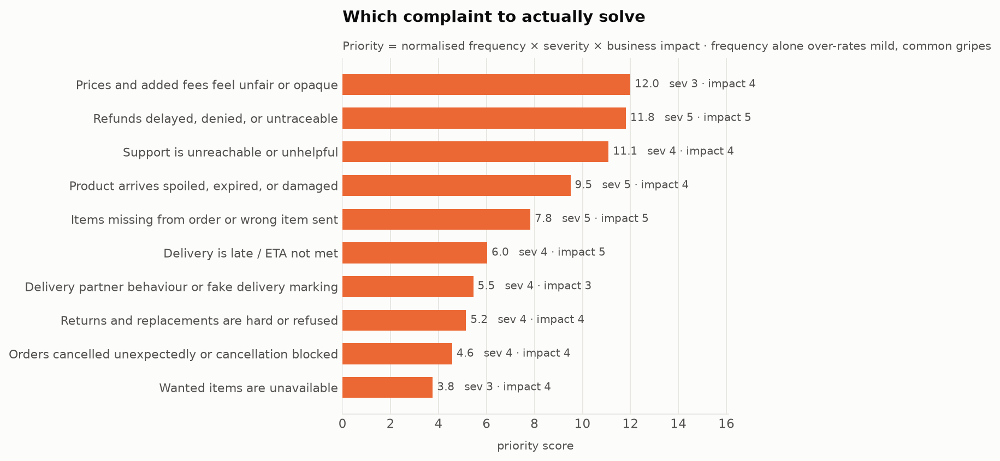

# 5. Problem Discovery & Definition

---

## 5.1 Why frequency alone is the wrong ranking

The most common complaint is not automatically the most valuable to fix. "App is slow" is frequent and
mild; "my refund never arrived" is rarer and a trust-destroying event. Ranking by volume alone would
systematically over-invest in mild, common annoyances.

Every theme therefore carries two hand-assigned weights, both documented and both arguable:

- **Severity (1–5)** — how bad it is for the user when it happens. 5 = lost money or lost trust.
- **Business impact (1–5)** — how directly it drives churn, support cost, or repeat-rate loss.

```
priority = (theme_share / max_theme_share) × severity × business_impact
```

Normalising frequency keeps one very common theme from swamping the severity signal.

## 5.2 The ranking



| Rank | Theme | Share of negative | Sev | Impact | **Priority** |
| --- | --- | --- | --- | --- | --- |
| 1 | **Prices and added fees feel unfair or opaque** | **20.2%** | 3 | 4 | **12.00** |
| 2 | Refunds delayed, denied, untraceable | 9.5% | 5 | 5 | 11.81 |
| 3 | Support unreachable or unhelpful | 14.0% | 4 | 4 | 11.09 |
| 4 | Product spoiled, expired, damaged | 9.6% | 5 | 4 | 9.50 |
| 5 | Items missing or wrong | 6.3% | 5 | 5 | 7.83 |
| 6 | Delivery late / ETA missed | 6.1% | 4 | 5 | 6.03 |
| 7 | Rider behaviour / fake delivery | 9.2% | 4 | 3 | 5.45 |
| 8 | Returns refused | 6.5% | 4 | 4 | 5.15 |
| 9 | Cancellations | 5.8% | 4 | 4 | 4.57 |
| 10 | Out of stock | 6.3% | 3 | 4 | 3.76 |
| 11 | Payment failures | 2.8% | 5 | 5 | 3.49 |
| 12 | App bugs | 3.1% | 3 | 3 | 1.38 |
| 13 | Packaging | 3.1% | 2 | 2 | 0.61 |
| 14 | Membership | 0.2% | 3 | 3 | 0.10 |

**The top three are close** — 12.00, 11.81, 11.09. The model does not hand down an obvious winner, and
pretending otherwise would be dishonest. The tie-break is done explicitly below.

### Honest weaknesses of this model

- **The weights are judgment.** Severity 3 for fees versus 5 for refunds is defensible but arguable;
  moving fees to severity 4 would put them clearly first, moving them to 2 would drop them to third. The
  ranking is *sensitive to weights I chose*.
- **Frequencies are lower bounds** ([02 §2.4](02_user_research.md)) — recall is imperfect and every share
  understates true incidence.
- **Share of negative reviews ≠ share of users.**

The model narrows fourteen themes to three credible candidates. It does not, by itself, pick the winner.

## 5.3 Tie-break: which of the top three should a product team own?

| | **Fees (12.00)** | Refunds (11.81) | Support (11.09) |
| --- | --- | --- | --- |
| Root cause | **Product/pricing design** | Payment ops + policy | Ops staffing + tooling |
| Fixable by a product team alone | **Yes** | Partly | Largely no |
| Cost to fix | **Low — UI and logic** | Medium | **High — headcount** |
| Revenue risk | **None if fees are unchanged** | Low | None |
| Upside beyond the complaint | **Raises AOV** | Cuts support tickets | Cuts ticket cost only |
| Competitive urgency | **High — Zepto has moved** | Low | Low |
| Segment affected | Otherwise-happy regulars | Already-churning users | Already-churning users |

**Fees win the tie-break** on four independent grounds:

1. **It is genuinely a product problem.** Refunds and support are largely operations problems wearing
   product clothing. A product team can ship a fee fix without new headcount or a policy rewrite.
2. **A competitor has already proven the upside.** Zepto scrapped handling and surge fees, and its fee
   complaint rate is **11.0% against Blinkit's 20.2%** ([02 §2.7](02_user_research.md)) — same cities,
   same category, identical sampling. The lever demonstrably works.
3. **It is the only candidate with business upside beyond the complaint.** Helping users clear fee
   thresholds raises basket size. Blinkit's AOV is *falling* (₹521 → ₹518) against a 0.6% NOV margin.
   Fixing refunds saves cost; fixing fees can make money.
4. **The affected segment is the most winnable.** Fee complainers are *moderately* dissatisfied (25.8% of
   3★ reviews vs 14.1% of 1★) and mention other problems at **half** the base rate
   ([03 §3.1](03_personas.md)). They still have the habit and have one objection. Refund and support
   complainers are further gone.

Refunds and support are **not dismissed** — both are P1, and refund transparency (JTBD-6) is the single
best follow-on because it reduces support volume upstream. They are simply not the first thing a product
team should build.

## 5.4 The problem statement

> **Blinkit's most frequent user complaint is not slow delivery — it is the cost of delivery.**
>
> Fees and pricing opacity drive **20.2% of all negative reviews (2,363 of 11,729)**, 44% more than the
> next theme, while delivery lateness ranks 9th at 6.1%. The complaint is loudest among *moderately*
> dissatisfied users — 25.8% of 3★ reviews — who mention no other problem, meaning these are otherwise
> satisfied, habituated, profitable customers with a single objection.
>
> The objection is not primarily that fees are too high. It is that they are **revealed too late and feel
> uncontrollable**: a ₹98 product becomes ₹152 at checkout, after the basket is built. Users demonstrate
> the unmet job themselves by gaming thresholds — adding filler items, waiting out surge windows.
>
> Meanwhile **Zepto has eliminated all handling and surge fees**, and carries roughly **half** Blinkit's
> fee complaint rate. Blinkit cannot match that: at **0.6% adjusted EBITDA margin** with a **falling AOV**,
> blanket fee removal would erase profitability built over five consecutive quarters.
>
> The problem is therefore to **make fees feel fair, predictable, and controllable — without removing
> them.**

## 5.5 How Might We

> ### **How might we make Blinkit's total cost feel transparent and controllable from the moment a user starts shopping — so that fees stop reading as a penalty and start reading as a choice — without reducing fee revenue or slowing the order?**

Deliberate properties of that framing:

- **"from the moment a user starts shopping"** — targets sequence, the actual grievance (JTBD-1)
- **"controllable"** — demands agency, not just disclosure (JTBD-2)
- **"reads as a choice"** — the goal is perception, which is what the reviews complain about
- **"without reducing fee revenue"** — the margin constraint is in the problem statement, not bolted on
- **"without slowing the order"** — protects Anjali, the urgency-driven loyalist ([03 §3.4](03_personas.md))

### Supporting HMWs

- How might we show landed cost *before* effort is sunk, without scaring users at the top of the funnel?
- How might we turn "you owe a ₹20 small-cart fee" into "add ₹47 more and we'll drop it"?
- How might we explain surge so it reads as a condition rather than opportunism?
- How might we do all this while *raising* AOV, given fee thresholds are already an AOV lever?

## 5.6 Success criteria

A solution succeeds if it:

| | Criterion |
| --- | --- |
| **1** | Reduces the fee share of negative reviews and support contacts |
| **2** | Does **not** reduce fee revenue per order |
| **3** | **Raises** AOV — directly addressing the ₹521 → ₹518 decline |
| **4** | Does not increase time-to-order (guardrail: Anjali) |
| **5** | Does not increase cart abandonment (guardrail: early cost disclosure could backfire) |

Criterion 5 names the real risk. Showing total cost earlier is *supposed* to help — but it could equally
cause users to abandon carts they would otherwise have completed. **That is an empirical question, not a
design opinion**, which is why this ships as an experiment ([13](13_experimentation.md)) rather than a
launch.

---

*Sources: `data/processed/theme_severity.csv`, `theme_frequency.csv`, `reviews_tagged.csv`. Financials
from Eternal Q1 FY27 results.*
